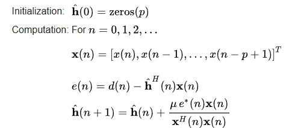

# 0407
# NLMS 演算法作業

---

## 1. 演算法公式圖
這是我上傳的公式截圖：

---

## 2. 演算法步驟說明
根據上圖，這個計算流程分為：
1. **初始化**：設定起始向量。
2. **計算誤差**：求出 $e(n)$。
3. **更新權重**：利用步長 $\mu$ 進行修正。

---

## 3. 學習筆記與重點
> **重點提示**：這是一個自適應濾波器的核心邏輯。

* **使用工具**：GitHub, HackMD
* **目標**：掌握 Markdown 排版技巧
* **進度**：已完成基礎設定 [x]
